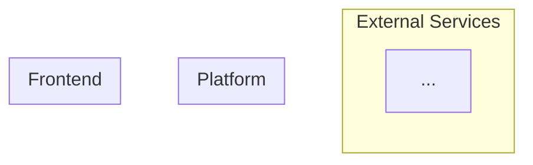

# Solution Architecture — [CLIENT_NAME]

**Date:** [DATE]
**Architect:** Claude Code (Senior [TECH_STACK] Architect)
**Status:** Draft (pre-estimate — will be expanded in Technical Proposal)
**Inputs:** TOR, Phase 0 Research, Phase 1 Assessment

---

## 1. Architecture Overview

**Recommended architecture style:** [coupled / decoupled / headless] with rationale tied to TOR requirements.

**Why this architecture:** [2-3 sentences explaining the choice, referencing specific TOR requirements and constraints]

---

## 2. Technology Stack Decisions

| Layer | Chosen Technology | Rationale (TOR Reference) | Alternatives Considered | Why Not |
|-------|------------------|---------------------------|------------------------|---------|
| CMS / Backend | [e.g., Drupal 11] | [TOR ref + reason] | [alt] | [reason] |
| Frontend | [e.g., Twig / Next.js] | [TOR ref + reason] | [alt] | [reason] |
| Search | [e.g., Search API + Solr] | [TOR ref + reason] | [alt] | [reason] |
| Hosting | [e.g., Acquia Cloud] | [TOR ref + reason] | [alt] | [reason] |
| CDN / WAF | [e.g., Cloudflare] | [TOR ref + reason] | [alt] | [reason] |
| CI/CD | [e.g., GitHub Actions] | [TOR ref + reason] | [alt] | [reason] |

---

## 3. Content Architecture

### Content Types

| Content Type | Key Fields | Platform Approach | TOR Reference |
|-------------|------------|-------------------|---------------|
| [type] | [fields] | [core / contrib / custom] | [TOR section] |

### Taxonomy Structure

| Vocabulary | Purpose | Hierarchical | Used By |
|-----------|---------|-------------|---------|
| [vocab] | [purpose] | [yes/no] | [content types] |

### Editorial Workflow

[Describe the authoring, review, and publishing workflow. Reference TOR requirements for approval chains, role-based access, scheduling.]

### Media Handling

[Approach to media library, image styles/responsive images, file management, DAM integration if applicable.]

---

## 4. Integration Approach

| Integration | System | Tier | Approach | Data Flow | TOR Reference |
|------------|--------|------|----------|-----------|---------------|
| [name] | [system] | [T1/T2/T3] | [REST/GraphQL/webhook/SDK] | [direction: inbound/outbound/bidirectional] | [TOR section] |

**Integration notes:**
- [Any shared auth patterns, API gateway considerations, error handling strategy]
- [Unknown API docs = tier bumped up per CARL Rule 17]

---

## 5. Frontend Component Breakdown

### Design System Approach

[New design system / reuse existing / extend existing. Reference to client's brand guidelines if known.]

### Global Components

| Component | Description | Complexity | Notes |
|-----------|------------|------------|-------|
| Header | [layout, nav levels, mobile] | [S/M/L] | [reference link] |
| Footer | [columns, content] | [S/M/L] | [reference link] |
| Navigation | [type, levels, mobile] | [S/M/L] | [reference link] |
| Search | [bar, autocomplete, overlay] | [S/M/L] | [reference link] |

### Content Components

| Component | Description | Used On | Complexity |
|-----------|------------|---------|------------|
| Hero Banner | [image/video, overlay, CTAs] | [pages] | [S/M/L] |
| Card | [image, title, excerpt] | [pages] | [S/M/L] |
| [component] | [description] | [pages] | [S/M/L] |

### Page Templates

| Template | Components Used | TOR Reference |
|----------|----------------|---------------|
| Homepage | [Hero, Card Grid, CTA, ...] | [TOR section] |
| [template] | [components] | [TOR section] |

---

## 6. Infrastructure & DevOps

### Hosting Recommendation

**Chosen:** [hosting platform]
**Rationale:** [why, referencing TOR requirements for uptime, geographic distribution, compliance]

### Environment Strategy

| Environment | Purpose | Access |
|------------|---------|--------|
| Local | Development | Developers |
| Dev | Integration testing | Team |
| Staging | UAT / client preview | Team + client |
| Production | Live site | Public |

### CI/CD Approach

[Pipeline description: source control → build → test → deploy. Tool choices and rationale.]

### Configuration Management

[Approach to config export/import, environment-specific settings, secret management.]

---

## 7. Migration Strategy (if applicable)

**Source system:** [system name and version]
**Approach:** [big bang / phased / parallel run]

| Content Type | Source | Target | Mapping Complexity | Volume |
|-------------|--------|--------|-------------------|--------|
| [type] | [source field] | [target field] | [simple/complex] | [count] |

**URL Strategy:** [redirect approach, URL pattern changes, SEO preservation]

---

## 8. Key Technical Decisions

For each major decision that significantly affects the estimate:

### Decision 1: [Decision Name]
- **Decision:** [what was decided]
- **Rationale:** [why, referencing TOR section/clause]
- **Alternative rejected:** [what and why not]
- **Estimate impact:** [which estimate categories/line items this affects and how]

### Decision 2: [Decision Name]
- **Decision:** [what was decided]
- **Rationale:** [why, referencing TOR section/clause]
- **Alternative rejected:** [what and why not]
- **Estimate impact:** [which categories this affects]

---

## 9. Risks & Technical Constraints

| Risk | Severity | Affected Area | Mitigation | TOR Reference |
|------|----------|--------------|------------|---------------|
| [risk] | [High/Medium/Low] | [architecture area] | [mitigation] | [TOR section] |

### Constraints from TOR
- [List hard constraints: browser support, accessibility level, performance targets, compliance requirements]

### Assumptions That Affect Architecture
- [Architecture-level assumptions that, if wrong, would change the solution approach]
