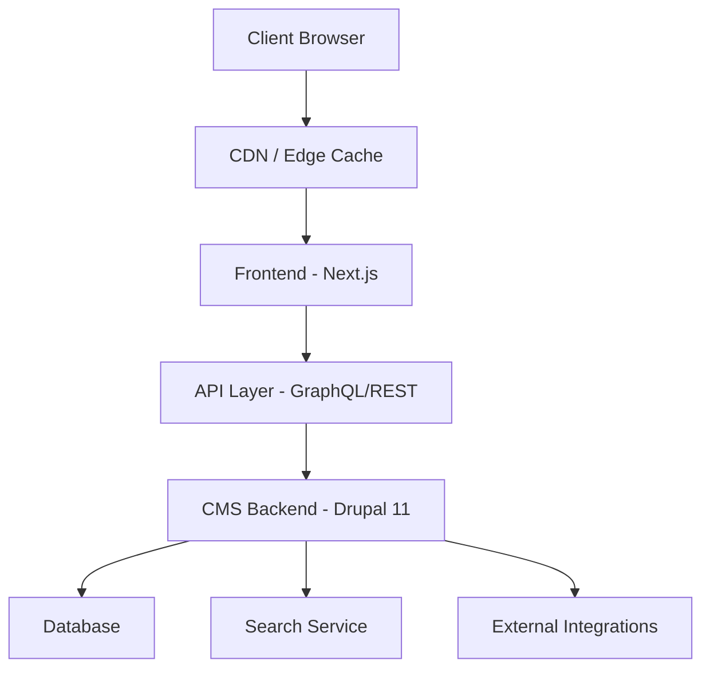
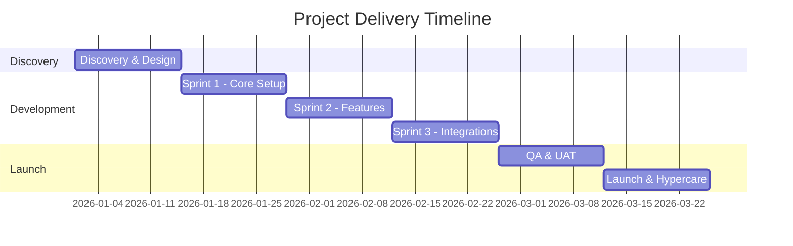

# Technical Proposal — [CLIENT_NAME]

**Prepared by:** QED42
**Date:** [DATE]
**Version:** 1.0
**Engagement:** [PROJECT_NAME]
**Technology Platform:** [TECH_STACK]

---

## 1. Executive Summary

[2-3 paragraphs: Demonstrate understanding of the business challenge outlined in the RFP. State what will be delivered. Highlight key differentiators of the proposed approach. End with a confidence statement. Use neutral language — avoid "you"/"your".]

---

## 2. Understanding of Requirements

### 2.1 Business Context

[Organization's business, industry, digital maturity, strategic goals — drawn from Phase 0 research and TOR. Use neutral language: "the organization", "the project", not "you"/"your".]

### 2.2 Project Objectives

[Bulleted list of primary objectives extracted from TOR, framed in business outcome language]

### 2.3 Key Success Criteria

[What "done" looks like — measurable outcomes tied to TOR requirements]

---

## 3. Proposed Architecture

### 3.1 Architecture Overview

[High-level architecture diagram using Mermaid. Example:]

[Accompany the diagram with a brief narrative explaining the architecture — monolith vs decoupled, frontend/backend split, key services]

### 3.2 Technology Stack

| Layer | Technology | Rationale |
|-------|-----------|-----------|
| CMS / Backend | [e.g., Drupal 11] | [why this choice] |
| Frontend | [e.g., Twig/server-rendered or Next.js] | [why] |
| Search | [e.g., Search API + DB backend] | [why] |
| Hosting | [e.g., Acquia/Pantheon/AWS] | [why] |
| CDN | [e.g., Cloudflare/Fastly] | [why] |
| CI/CD | [e.g., GitHub Actions] | [why] |

### 3.3 Architecture Decisions

[Key architectural choices and their rationale — why this approach over alternatives]

---

## 4. Solution Approach

### 4.1 Content Architecture

[How content will be structured — content types, taxonomies, media handling, editorial workflows. Name specific modules/packages.]

### 4.2 Integrations

[Each integration point — what it connects, how (API, module, webhook), and specific tools/services used]

### 4.3 Migration Strategy

[Source system, migration approach, content volume, timeline. If no migration, state "Greenfield implementation."]

### 4.4 Frontend / User Experience

[Theming approach, component library, responsive strategy, performance targets]

### 4.5 DevOps & Infrastructure

[Environments, CI/CD pipeline, deployment strategy, monitoring, backup/recovery]

### 4.6 SEO, Accessibility & Performance

[Technical SEO approach, WCAG compliance level, Core Web Vitals targets, caching strategy]

### 4.7 Security

[Authentication, authorization, data protection, security headers, compliance requirements]

---

## 5. Delivery Approach

### 5.1 Methodology

[Agile/Scrum, sprint cadence, ceremonies, communication cadence]

### 5.2 Phased Delivery Plan

[Use a Mermaid Gantt chart to illustrate the delivery phases:]

[Accompany with a brief description of each phase and its key deliverables]

---

## 6. Team Composition

| Role | Seniority | Allocation | Responsibilities |
|------|-----------|------------|-----------------|
| Technical Architect | Senior | [%] | Architecture, code reviews, technical decisions |
| Backend Developer | Senior | [%] | CMS development, integrations, migrations |
| Backend Developer | Mid | [%] | Module development, configuration, testing |
| Frontend Developer | Senior | [%] | Theme development, component library |
| QA Engineer | Mid | [%] | Test planning, execution, automation |
| Project Manager | Senior | [%] | Sprint management, client communication |
| DevOps Engineer | Mid | [%] | CI/CD, infrastructure, deployments |

---

## 7. Assumptions & Scope Boundaries

### 7.1 In-Scope

[Bulleted list of what IS included — be specific]

### 7.2 Recommended for Phase 2

[Items excluded from this phase but recommended as future enhancements — framed positively as growth opportunities]

| Item | Why Phase 2 |
|------|-------------|
| [feature] | [rationale — e.g., "requires baseline metrics from Phase 1"] |

### 7.3 Key Assumptions

[Numbered list of all assumptions from the estimate, grouped by domain. Each assumption clearly states what is in-scope and what would trigger a change request.]

#### Content & Architecture
1. [assumption with CR boundary]

#### Integrations
1. [assumption with CR boundary]

#### Infrastructure & DevOps
1. [assumption with CR boundary]

#### Client Responsibilities
1. [what the client organization is expected to provide — content, access, decisions, reviews, feedback timelines]

---

## 8. Risk Register

| # | Risk | Likelihood | Impact | Mitigation |
|---|------|-----------|--------|------------|
| 1 | [risk] | H/M/L | H/M/L | [mitigation strategy] |

---

## 9. Why QED42

[2-3 paragraphs: Relevant experience, team expertise, similar projects delivered, technology partnerships, client references if applicable]

---

## 10. Next Steps

1. [Proposal review and Q&A session]
2. [Contract and SOW finalization]
3. [Kickoff and discovery phase]

---

*This proposal is valid for [30/60/90] days from the date of issue.*
